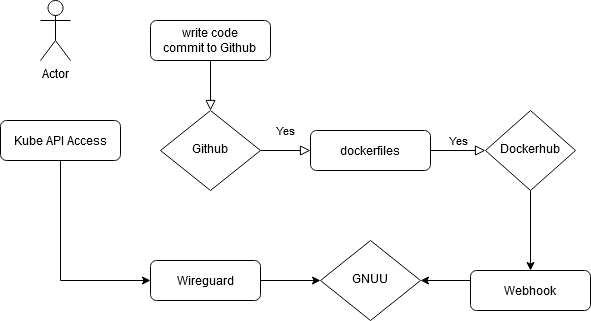

GNUU Infrastructure Documentation
=================================

Architecture Overview
---------------------


K3S
---

Install [Ranchers K3S](https://k3s.io/) as a lightweight Kubernetes service,
which runs on a single server and is also scalable to more nodes with an
oneliner. 
Basic installation (i.e. on a Ubuntu 20.04 Server):


```
curl -sfL https://get.k3s.io | sh -

```
This command will also upgrade existing K3S installations. Optional there is an [automated update procedure](https://rancher.com/docs/k3s/latest/en/upgrades/automated/)


To extend node port range in /etc/systemd/system/k3s.service
change

ExecStart=/usr/local/bin/k3s server --kube-apiserver-arg service-node-port-range=1-65535

```
systemctl daemon-reload
systemctl restart k3s.service

```
Verify config, enabled addons.


```
k3s check-config

Verifying binaries in /var/lib/rancher/k3s/data/3a8d3d90c0ac3531edbdbde77ce4a85062f4af8865b98cedc30ea730715d9d48/bin:
- sha256sum: good
- links: good

System:
- /sbin iptables v1.6.1: older than v1.8
- swap: disabled
- routes: ok

Limits:
- /proc/sys/kernel/keys/root_maxkeys: 1000000

modprobe: module configs not found in modules.dep
info: reading kernel config from /boot/config-4.15.0-106-generic ...

Generally Necessary:
- cgroup hierarchy: properly mounted [/sys/fs/cgroup]
- /sbin/apparmor_parser
apparmor: enabled and tools installed
- CONFIG_NAMESPACES: enabled
- CONFIG_NET_NS: enabled
- CONFIG_PID_NS: enabled
- CONFIG_IPC_NS: enabled
- CONFIG_UTS_NS: enabled
- CONFIG_CGROUPS: enabled
- CONFIG_CGROUP_CPUACCT: enabled
- CONFIG_CGROUP_DEVICE: enabled
- CONFIG_CGROUP_FREEZER: enabled
- CONFIG_CGROUP_SCHED: enabled
- CONFIG_CPUSETS: enabled
- CONFIG_MEMCG: enabled
- CONFIG_KEYS: enabled
- CONFIG_VETH: enabled (as module)
- CONFIG_BRIDGE: enabled (as module)
- CONFIG_BRIDGE_NETFILTER: enabled (as module)
- CONFIG_NF_NAT_IPV4: enabled (as module)
- CONFIG_IP_NF_FILTER: enabled (as module)
- CONFIG_IP_NF_TARGET_MASQUERADE: enabled (as module)
- CONFIG_NETFILTER_XT_MATCH_ADDRTYPE: enabled (as module)
- CONFIG_NETFILTER_XT_MATCH_CONNTRACK: enabled (as module)
- CONFIG_NETFILTER_XT_MATCH_IPVS: enabled (as module)
- CONFIG_IP_NF_NAT: enabled (as module)
- CONFIG_NF_NAT: enabled (as module)
- CONFIG_NF_NAT_NEEDED: enabled
- CONFIG_POSIX_MQUEUE: enabled

Optional Features:
- CONFIG_USER_NS: enabled
- CONFIG_SECCOMP: enabled
- CONFIG_CGROUP_PIDS: enabled
- CONFIG_BLK_CGROUP: enabled
- CONFIG_BLK_DEV_THROTTLING: enabled
- CONFIG_CGROUP_PERF: enabled
- CONFIG_CGROUP_HUGETLB: enabled
- CONFIG_NET_CLS_CGROUP: enabled (as module)
- CONFIG_CGROUP_NET_PRIO: enabled
- CONFIG_CFS_BANDWIDTH: enabled
- CONFIG_FAIR_GROUP_SCHED: enabled
- CONFIG_RT_GROUP_SCHED: missing
- CONFIG_IP_NF_TARGET_REDIRECT: enabled (as module)
- CONFIG_IP_SET: enabled (as module)
- CONFIG_IP_VS: enabled (as module)
- CONFIG_IP_VS_NFCT: enabled
- CONFIG_IP_VS_PROTO_TCP: enabled
- CONFIG_IP_VS_PROTO_UDP: enabled
- CONFIG_IP_VS_RR: enabled (as module)
- CONFIG_EXT4_FS: enabled
- CONFIG_EXT4_FS_POSIX_ACL: enabled
- CONFIG_EXT4_FS_SECURITY: enabled
- Network Drivers:
  - "overlay":
    - CONFIG_VXLAN: enabled (as module)
      Optional (for encrypted networks):
      - CONFIG_CRYPTO: enabled
      - CONFIG_CRYPTO_AEAD: enabled
      - CONFIG_CRYPTO_GCM: enabled
      - CONFIG_CRYPTO_SEQIV: enabled
      - CONFIG_CRYPTO_GHASH: enabled
      - CONFIG_XFRM: enabled
      - CONFIG_XFRM_USER: enabled (as module)
      - CONFIG_XFRM_ALGO: enabled (as module)
      - CONFIG_INET_ESP: enabled (as module)
      - CONFIG_INET_XFRM_MODE_TRANSPORT: enabled (as module)
- Storage Drivers:
  - "overlay":
    - CONFIG_OVERLAY_FS: enabled (as module)

STATUS: pass

```

Admin Clients
-------------

Interaction with the cluster on the server self with kubectl and helm.
It's also possible on remote client (not document here):


```
snap install kubectl --classic
snap install helm --classic
kubectl completion bash  >> .bashrc
helm completion bash  >> .bashrc
bash
export KUBECONFIG=/var/lib/rancher/k3s/server/cred/admin.kubeconfig

```

Traefik/Ingress
---------------

K3S is shipped with [Traefik Ingress Service](https://docs.traefik.io/).
Verify if it's really there:

```
helm -n kube-system list

NAME    NAMESPACE       REVISION        UPDATED                                 STATUS          CHART           APP VERSION
traefik kube-system     5               2020-06-29 16:44:29.673154471 +0000 UTC deployed        traefik-1.81.0  1.7.19
```

In `/var/lib/rancher/k3s/server/manifests/traefik.yaml` enable Let's Encrypt:


```
    acme:
      enabled: true

```


Cert-Manager
------------

The [Cert-Manager](https://cert-manager.io/docs/) handles certificate issueing and monitores certifcates
lifetime and re-issueing automatically:


```
helm repo add jetstack https://charts.jetstack.io
helm install cert-manager --namespace cert-manager jetstack/cert-manager
kubectl apply --validate=false -f https://github.com/jetstack/cert-manager/releases/download/v0.15.1/cert-manager.crds.yaml
kubectl apply -f https://raw.githubusercontent.com/gnuu-de/k8s/master/clusterissuer.yaml
```

OpenEBS
-------

[OpenEBS](https://openebs.io/) provides volume storage to Kubernetes. Best option in Open Source
without cloud backend. On a single server we have only one storage class without redundancy:


```
kubectl apply -f https://raw.githubusercontent.com/openebs/openebs/master/k8s/openebs-operator.yaml
kubectl apply -f https://raw.githubusercontent.com/gnuu-de/k8s/master/storageclass.yaml
```

MySQL
-----

For user- and configuration management a MySQL instance is required. Best shipped in a Helm
Chart and installed with the OpenEBS volume backend:


```
helm repo add stable https://kubernetes-charts.storage.googleapis.com/
helm -n gnuu upgrade -i mysql --set persistence.storageClass=openebs-standalone stable/mysql --create-namespace
kubectl get secret --namespace gnuu mysql -o jsonpath="{.data.mysql-root-password}" | base64 --decode; echo
```

With the generated root password it's possible to connect to the MySQL instance, i.e. from
an admin POD:

```
kubectl get service mysql -o jsonpath='{.spec.clusterIP}'
kubectl run -i --tty busybox --image=gnuu/busybox --restart=Never -- bash
# apt update && apt install mysql-client
# mysql -h<ClusterIP> -uroot -p<password>
```

MySQL User
----------

Create one or more MySQL user and set permissions:


```
CREATE USER 'gnuuweb'@'%' IDENTIFIED BY 'password';
GRANT ALL PRIVILEGES ON gnuu.* TO 'gnuuweb'@'%';
flush privileges;
```


GNUU Application
----------------

### Container developement

 
All GNUU application used their [own Docker files](https://github.com/gnuu-de/dockerfiles).
Docker images are auto-build and published in [Docker Hub](https://hub.docker.com/orgs/gnuu).
Image names are common, like inn, postfix, but there are special adjustments for GNUU like
bsmtp backend for e-mail.

### GNUU Kubernetes deployment

All deployment manifests are in the [K8S repo](https://github.com/gnuu-de/k8s). There are core
deployments like storage or the default namespace and then in each folder app specific
deployments. A HELM chart is planned for the future, currently it's easier to deploy the
manifest per app. To let the ip-addresses of clients to the apps, the main PODs are running
with host-network and host-port. That's required for access limitations in mail & news.

TODO: set security context, pod security policy, more images as none-root

### GNUU web services

Static web content is delivered on behalf of nginx, Let's Encrypt and Ingress service. 
Source of the static content is the [www repo](https://github.com/gnuu-de/www).
The logic of the web services like user management or site configuration are in 
the [apps repo](https://github.com/gnuu-de/apps), There are Python Flask services
as replacement of Perl CGI and a Job API to update configuration files or configmaps
in Kubernetes. For that reason are service accounts created via RBAC.

### Retirements

#### Chat System

http://www.gnuu.de/chat was required for the yearly association meeting. 
The PHP application (http://www.ajaxchat.org) is outdated, insecure, unstable, and for some
user not comfortable. Should be replaced by a meeting tool.

#### Mailing Lists (Mailman)

In fact there are only 2 mailinglists (gnuu-talk and gnuu-admin) with a very low traffic
(< 10 postings per year). Mailman needs more resource for maintenance as there is effort
for 10 postings. Should be replaced by a managed community tool or a modern tool which
joins chat and e-mail.

#### Various Statistics

##### MRTGs, Web, Mail, DNS

Most of them are broken (http://www.gnuu.de/statistik.html) Newsreport needs a new home:
standalone app for serving http based on the report data from the news storage.

##### de-posters, Freenix

de-posters counted the postings in de.* newsgroups per person per month (was also part of Mailman).
Freenix is still alive (http://top1000.anthologeek.net/), uucp.gnuu.de on play 460.


### Deploy Pipeline



CI/CD is done in the following ways:

* Commit in [dockerfiles repo](https://github.com/gnuu-de/dockerfiles/) will trigger various [Github Actions](https://github.com/gnuu-de/dockerfiles/tree/master/.github/workflows). Docker images will build and push to Docker Hub. A Webhook triggered api.gnuu.de. First task is notification the Gnuu Dev Matrix Channel about a new image version and a rolling upgrade of the application which used the image.

* Commit in [Apps repo](https://github.com/gnuu-de/apps/) will trigger [Github Actions](https://github.com/gnuu-de/apps/tree/master/.github/workflows) with directly application restart. A [Webhook in the repo](https://github.com/gnuu-de/apps/settings/hooks) sends notification on the Gnuu Matrix CHannel. This is done via the Github integration service in Matrix/Element.

* Furthermore each configuration change from the user via web ui will call the internal job service. This service builds the specific config maps and reloads the news server configuration.

### Functional tests

described in [TEST.md](TEST.md)

### Backup/S3

Deployed infrastructure is hosted as code, no backups of configuration files are required. Custom packages are as source code available and built in K8S jobs.
For user data [Velero S3 backup](https://docs.openebs.io/v090/docs/next/backup.html) was planned which works not on uucp.gnuu.de. As workaround we have a [K8S Job](https://github.com/gnuu-de/k8s/blob/master/backup/job.yml) which copies /data to Strato Hidrive S3 storage. This can be applied as cron as well.

### TODO's

* News config http://www.gnuu.de/config/

* [IPv6](https://kubernetes.io/docs/concepts/services-networking/dual-stack/) (as fallback we have IPv4-only)

* ~~~Backup concept/S3~~~

* Monitoring 
  * https://github.com/coreos/prometheus-operator
  * https://github.com/rycus86/prometheus_flask_exporter

* ~~Functional tests UUCP packer~~

* Helm Chart/[Kubernetes Operator](https://sdk.operatorframework.io/docs/helm/quickstart/)

* ~~CI/CD pipeline~~

* Firewall/Server hardening
